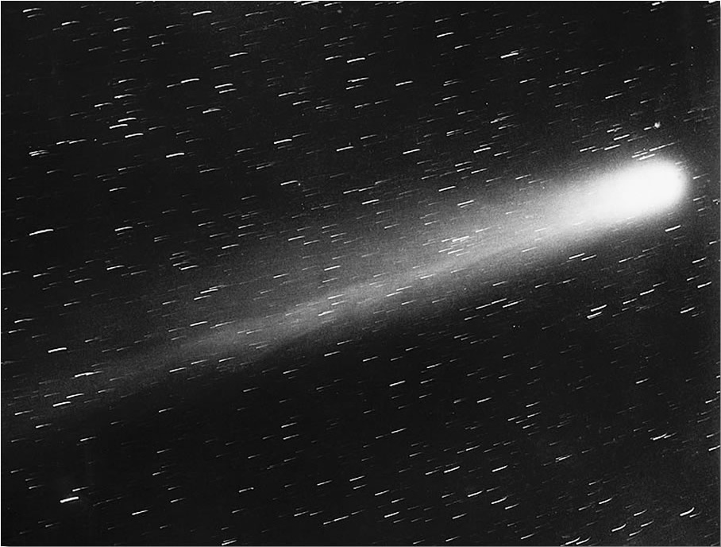

# Explore Close Approaches of Near-Earth Objects


Halley's Comet

# Data
NASA's Center for Near-Earth Object Studies (CNEOS) provides data about close approaches of NEOs to Earth [here](https://ssd-api.jpl.nasa.gov/doc/cad.html). 

# Usage

### Overview
`python3 main.py --help` 

### `inspect`

The `inspect` subcommand inspects a single NEO, printing its details in a human-readable format. The NEO is specified with exactly one of the `--pdes` option (the primary designation) and the `--name` option (the IAU name). The `--verbose` flag additionally prints out, in a human-readable form, all known close approaches to Earth made by this NEO. Each of these options has an abbreviated version. To remind yourself of the full interface, you can run `python3 main.py inspect --help`:

```
$ python3 main.py inspect --help
usage: main.py inspect [-h] [-v] (-p PDES | -n NAME)

Inspect an NEO by primary designation or by name.

optional arguments:
  -h, --help            show this help message and exit
  -v, --verbose         Additionally, print all known close approaches of this NEO.
  -p PDES, --pdes PDES  The primary designation of the NEO to inspect (e.g. '433').
  -n NAME, --name NAME  The IAU name of the NEO to inspect (e.g. 'Halley').
```

e.g.

```
# Inspect the NEO with a primary designation of 433 (that's Eros!)
$ python3 main.py inspect --pdes 433
NEO 433 (Eros) has a diameter of 16.840 km and is not potentially hazardous.
```


